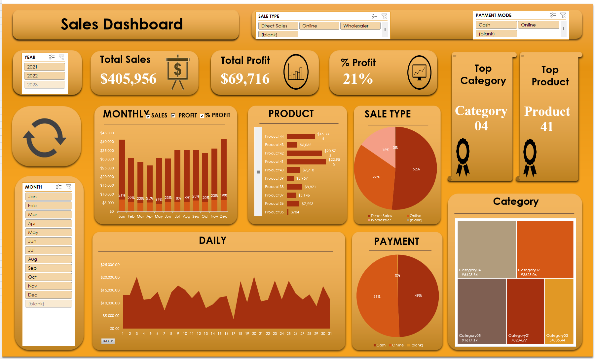

# 📦 Retail Sales Dashboard – Excel

## Overview
Analysis of retail sales transaction data covering products across
5 categories, tracking revenue, profit, and sales patterns throughout 2021.

## Dataset
- **Transactions:** Sales data from Jan–Dec 2021
- **Fields:** Date, Product, Category, Sale Type, Payment Mode,
  Quantity, Buying Price, Selling Price, Total Revenue

## Key Metrics Tracked
- Total Buying vs Selling Value
- Profit Margin per Product/Category
- Sales breakdown by type (Online, Direct Sales, Wholesaler)
- Payment mode analysis (Cash vs Online)

## Tools Used
- Microsoft Excel
- Power Query / Pivot Tables

## Files
| File | Description |
|------|-------------|
| `SalesDashboard.xlsx` | Main dashboard with raw data and analysis |

## Preview
# Retail-Sales-Dashboard---Excel
